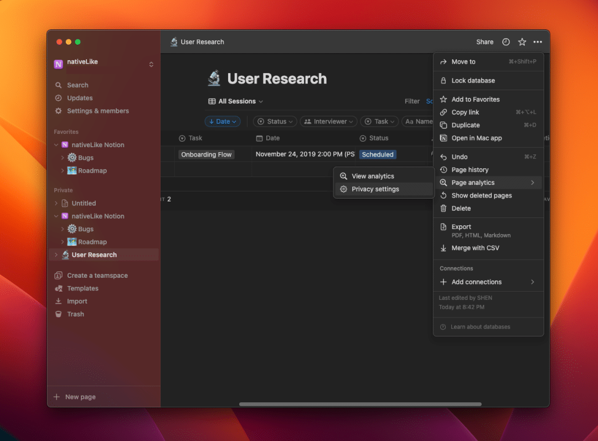
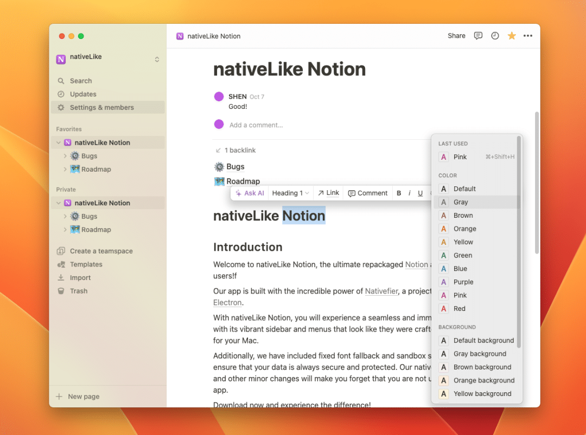
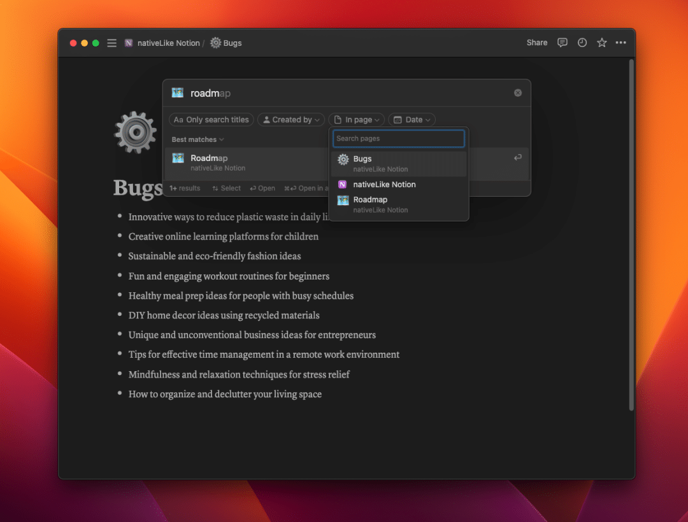
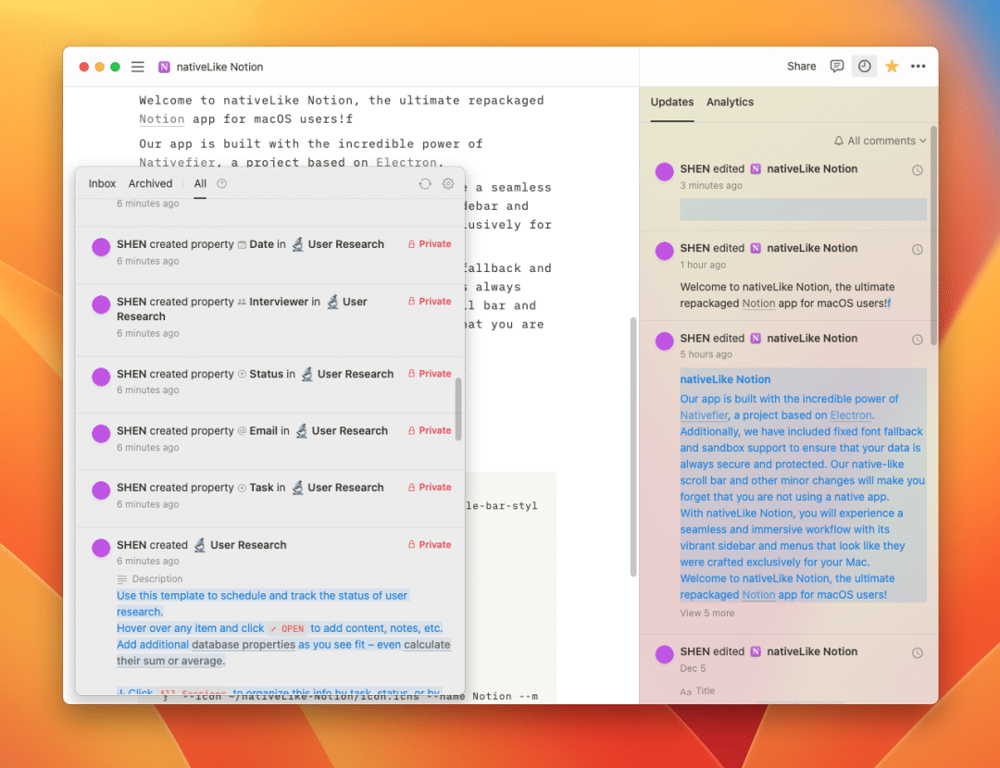

<picture>
  
</picture>

# nativeLike Notion

## Introduction

Welcome to nativeLike Notion, the ultimate repackaged [Notion](https://www.notion.so/) app for macOS users!

Our app is built with the incredible power of [Nativefier](https://github.com/nativefier/nativefier), a project based on [Electron](https://www.electronjs.org).

With nativeLike Notion, you will experience a seamless and immersive workflow with its vibrant sidebar and menus that look like they were crafted exclusively for your Mac.

Additionally, we have included fixed font fallback and sandbox support to ensure that your data is always secure and protected. Our native-like scroll bar and other minor changes will make you forget that you are not using a native app.

Download now and experience the difference!

## Screenshots









## Build

If you want a detailed tutorial, please refer to [Nativefier Documentation](https://github.com/nativefier/nativefier/blob/master/API.md).

```zsh
nativefier https://www.notion.so/login --title-bar-style 'hiddenInset' --browserwindow-options '{
    "show": false,
    "vibrancy": "sidebar",
    "trafficLightPosition": {
        "x": 20,
        "y": 18
    },
    "webPreferences": {
        "sandbox": true,
        "spellcheck": false
    }
}' --icon ~/nativeLike-Notion/icon.icns --name Notion --min-height 400 --min-width 660 --inject ~/nativeLike-Notion/inject.css --arch universal --mac

```